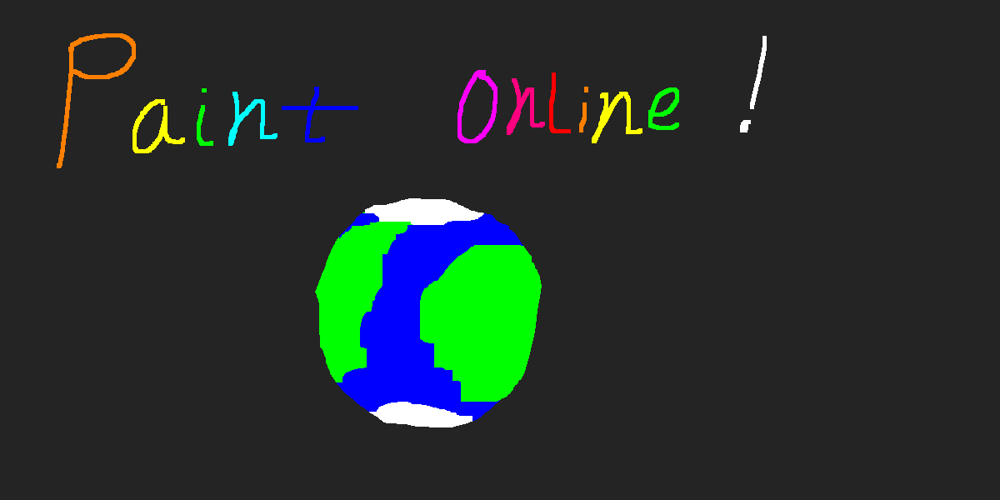

# Paint Online
A NodeJS server that allows multiple people to paint in real time on a virtual canvas.

**Features:**
* Real time drawing
* Name tags when drawing
* Drawings are retained server side
* Downloadable as PNG
* Continuous lines
* Multiple colours
* Variable brush sizes
* Eraser

**Install**

Download the server and run app.js from NodeJS